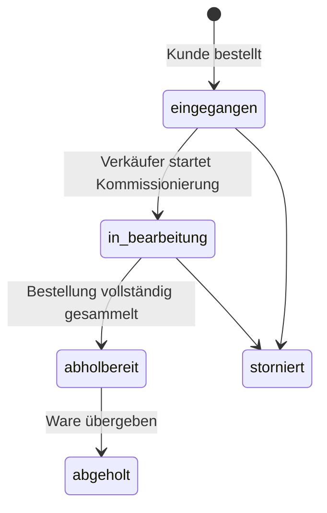

# План развития: магазин стройматериалов с самовывозом

## Цель

Создать минималистичный, понятный интернет-магазин собственных стройматериалов.
Магазин продаёт около 400 реальных товарных позиций, не выполняет доставку и принимает
заказы только на самовывоз из одной точки.

Целевой путь покупателя:

1. Находит товар через поиск, категории или фильтры.
2. Проверяет цену, характеристики и доступное для самовывоза количество.
3. Добавляет позиции в корзину.
4. Оформляет заказ с контактными данными и способом оплаты при получении.
5. Получает номер заказа и статус «собирается».
6. Продавец видит заказ, собирает позиции, переводит его в «готов к выдаче».
7. Покупатель забирает заказ в магазине, а продавец отмечает выдачу.

## Границы первой версии

В первой версии не нужны:

- доставка и расчёт доставки;
- выбор нескольких складов или точек выдачи;
- онлайн-оплата;
- маркетплейс, сторонние продавцы и комиссии;
- сложные акции, программа лояльности и отзывы.

Оплата — при получении, если позже не будет согласован другой сценарий.

## Дизайн-принципы

- Светлый нейтральный фон, тёмная типографика и один акцентный цвет.
- Одна основная цель на каждом экране: найти, выбрать или оформить.
- Минимум баннеров и декоративных карточек; больше пространства, понятные отступы.
- Наличие, цена, единица продажи и кнопка добавления в корзину всегда видимы.
- Интерфейс сначала проектируется для телефона, затем расширяется для desktop.
- Tailwind CSS 4 используется для единой системы отступов, цветов, состояний и адаптивности.
- Переиспользуемые компоненты: `Button`, `Badge`, `ProductCard`, `QuantityControl`,
  `Accordion`, `Drawer`, `Select`, `Toast`, `EmptyState`.

## Карта экранов

| Экран | Главная задача | Обязательные элементы |
| --- | --- | --- |
| Главная | Быстро начать покупки | поиск, категории, популярные товары, преимущества самовывоза |
| Каталог | Найти и сравнить | поиск, фильтры, сортировка, понятные карточки |
| Карточка товара | Принять решение | реальные фото, бренд, артикул/GTIN, характеристики, остаток, цена, добавление в корзину |
| Корзина | Проверить заказ | позиции, количество, итог, предупреждение о самовывозе |
| Оформление | Передать заказ продавцу | имя, телефон, e-mail, комментарий, согласие, оплата при получении |
| Подтверждение | Дать уверенность | номер заказа, адрес, часы работы, следующий шаг |
| Мои заказы | Показать состояние | номер, состав, сумма, статус, дата выдачи |
| Админ: заказы | Собрать и выдать | состав, количество, контакт, статус, печать/экспорт |

## Каталог: реальные данные

Для каждой из ~400 позиций нужен единый источник данных, а не демо-значения.

Минимальные поля:

```text
id, slug, category, brand, manufacturerSku, gtin,
name, shortDescription, description,
priceGross, saleUnit, basePrice, baseUnit,
packSize, weightKg, dimensions, specs,
images[], stockQty, pickupAvailable,
featured, active, sourceUrl, lastSyncedAt
```

Правила данных:

- Использовать реальные названия, характеристики и артикулы производителей.
- Изображения брать только из собственной фотосъёмки, официального медиакита или по лицензии.
- Текущую цену и остаток вести как данные магазина, а не копировать с сайтов конкурентов.
- `pickupAvailable` рассчитывать из реального остатка конкретной точки выдачи.
- В интерфейсе показывать точное состояние: «в наличии», «мало осталось», «под заказ».

Стартовые товарные группы:

1. Гипсокартон и профили.
2. Цемент, бетон, растворы, клеи.
3. Утеплители, плёнки и герметизация.
4. Плиты, пиломатериалы, OSB, фанера.
5. Кирпич, блоки, кладочные материалы.
6. Кровля и водоотвод.

## Самовывоз и заказ

### Тексты интерфейса

Заменить:

- «Lieferung & Abholung» → «Bestellung & Abholung»;
- «Angebot anfragen» → «Bestellung aufgeben»;
- «Lieferung zur Baustelle» → убрать;
- «Versand» в корзине → убрать;
- «Lieferkosten» → убрать;
- «Zentrallager» как выбор покупателя → убрать из публичного интерфейса.

Постоянное сообщение в корзине и оформлении:

> Nur Abholung im Markt. Wir bereiten Ihre Bestellung vor und informieren Sie, sobald sie bereit ist.

### Статусы заказа



Рекомендуемые отображаемые названия:

| Код | Текст для покупателя | Значение для продавца |
| --- | --- | --- |
| `eingegangen` | Bestellung eingegangen | Новый заказ, ещё не собран |
| `in_bearbeitung` | Wird für Sie zusammengestellt | Сборка начата |
| `abholbereit` | Abholbereit | Можно выдать |
| `abgeholt` | Abgeholt | Заказ закрыт |
| `storniert` | Storniert | Заказ отменён |

## Изменения в функциональности

### P0 — обязательные

1. Удалить доставку из публичного UI, фильтров, каталога, карточки товара, корзины и оформления.
2. Сделать одну фиксированную точку самовывоза с адресом и часами работы из конфигурации сайта.
3. Переименовать «Anfrage» в полноценный заказ на самовывоз.
4. Проверять наличие и резервировать или помечать требуемое количество при создании заказа.
5. В админ-панели показывать состав заказа, количество, примечание, контакты и текущий статус.
6. На странице успеха показывать номер заказа, адрес и условие «оплата при получении».
7. Добавить уведомление продавцу о новом заказе: сначала в админ-панели, затем e-mail/мессенджер.

### P1 — после P0

1. Выбор желаемого времени самовывоза.
2. E-mail или SMS покупателю при статусе `abholbereit`.
3. Экран сборки для продавца: чек-лист по позициям и кнопка «всё собрано».
4. Низкий остаток и автоматическое скрытие отсутствующих позиций.
5. Импорт каталога из CSV/XLSX и массовое редактирование товаров.
6. QR-код или короткий код заказа для быстрой выдачи.

### P2 — после запуска

1. Интеграция с учётом склада/кассой.
2. Синхронизация остатков в реальном времени.
3. Личный кабинет с историей заказов и повторным заказом.
4. Проектные подборки и калькуляторы материалов.

## Технический план

1. Сохранить App Router и текущий каталог, но привести данные к модели собственного ассортимента.
2. Оставить Server Components для страниц каталога и Client Components только для корзины, фильтров и форм.
3. Обновить API оформления: принимать только `pickup`, валидировать товар, количество и остаток на сервере.
4. Обновить БД:
   - исключить `delivery` из пользовательского потока;
   - добавить статусы `in_bearbeitung`, `abholbereit`, `abgeholt`, `storniert`;
   - сохранять снимки товара, цены и единицы продажи в строках заказа;
   - продумать атомарное резервирование остатков.
5. Добавить тесты на:
   - оформление только при достаточном остатке;
   - невозможность заказать доставку через API;
   - смену статусов;
   - неизменность цены и названия в уже созданном заказе.
6. Проверить desktop и mobile через локальный браузер, затем `pnpm lint`, `pnpm test`, `pnpm build`.

## Порядок внедрения

1. Согласовать название магазина, адрес точки выдачи, часы работы и способ оплаты.
2. Сделать P0 для самовывоза на текущем демонстрационном каталоге.
3. Импортировать первые 30–50 реальных товаров и проверить структуру данных.
4. Загрузить и провалидировать все ~400 позиций.
5. Подключить уведомление продавца и провести тестовый заказ от оформления до выдачи.
6. Подготовить юридические страницы для настоящего магазина до публичного запуска.

## Решения, которые нужны до запуска

- Название и логотип магазина.
- Точный адрес, часы работы и правила хранения готового заказа.
- Оплата только наличными, картой при получении или оба варианта.
- Нужен ли выбор времени самовывоза.
- Источник каталога, цен и остатков: CSV, учётная система, касса или ручное ведение.
- Канал уведомлений продавца: e-mail, Telegram, WhatsApp Business или интерфейс администратора.
